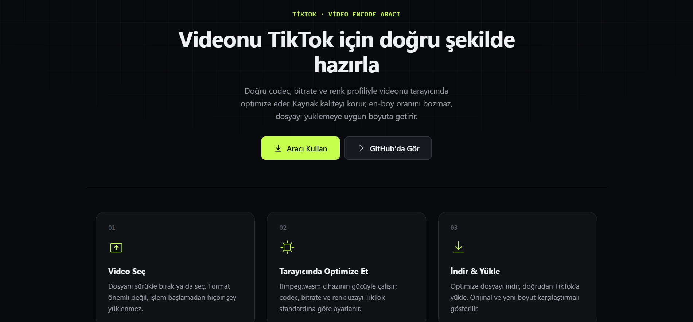

# Netlik — TikTok için Video Optimize Et

[](https://tiktok-optimizer.pages.dev)
[](LICENSE)
[](#)

Tarayıcıda çalışan, sunucusuz video encode aracı. Videonu seç, TikTok'un beklediği
çözünürlük/codec/renk profiline göre yeniden encode edilsin, indir. Hiçbir dosya
hiçbir sunucuya gitmez — tüm işlem [ffmpeg.wasm](https://ffmpegwasm.netlify.app/)
ile cihazının içinde çalışır.

**Canlı demo:** https://tiktok-optimizer.pages.dev


*(Ekran görüntüsü henüz eklenmedi — repo köküne `screenshot.png` eklenmesi gerekiyor.)*

## Özellikler

- Sürükle-bırak veya dosya seçici ile video yükleme
- Gerçek zamanlı encode ilerleme çubuğu
- Önizleme + indirme + orijinal/optimize boyut karşılaştırması
- Gelişmiş panel: CRF (kalite), maks. çözünürlük ve otomatik kenar kırpma ayarlanabilir
- Build step yok — tek klasör, doğrudan statik hosting'e yüklenebilir

## Varsayılan encode ayarları

Bu tablo `app.js` içindeki `encode()` fonksiyonunun ürettiği gerçek `ffmpeg` komutuyla
birebir eşleşir.

| Ayar | Değer |
|---|---|
| Çözünürlük | Kaynağın en-boy oranı korunur — **pad, siyah bar veya kırpma eklenmez.** Kısa kenar 1080px'i aşıyorsa 1080'e indirilir; uzun kenar seçili üst sınırı (varsayılan 1920px, Gelişmiş panelden 1280/960 seçilebilir) aşıyorsa, kısa kenarı 1080'in altına düşürmeyecek şekilde sınırlanır. İkisi çakışırsa kısa kenar korunur, uzun kenar sınırı aşabilir. |
| SAR normalizasyonu | `scale='trunc(iw*sar/2)*2:trunc(ih/2)*2',setsar=1` ile piksel oranı tam 1:1'e sabitlenir — anamorfik (kare olmayan piksel) kaynaklarda görüntü sıkışması önlenir. İkinci ölçekleme adımından sonra `setsar=1` tekrar uygulanır. |
| Video codec | `libx264`, `-profile:v high`, `-level 4.2` |
| Kalite | `-crf 20 -preset slow -maxrate 12M -bufsize 16M` (CRF, Gelişmiş panelden 16–28 arası ayarlanabilir; varsayılan 20) |
| Piksel formatı | `yuv420p` |
| Renk uzayı | `bt709` (`-colorspace -color_primaries -color_trc`) |
| FPS | kaynak fps korunur, dönüştürme yapılmaz |
| Ses | AAC, `-b:a 320k` |
| Konteyner | MP4, `-movflags +faststart` |
| Kenar kırpma (opsiyonel) | Gelişmiş panelde "Otomatik kenar kırp" açılırsa önce `cropdetect=64:2:0` ile kaynaktaki boş/koyu kenarlar tespit edilip kırpılır, sonra yukarıdaki ölçekleme uygulanır. Varsayılan kapalı. |

Encode sonrası çıktının SAR/DAR değeri `ffmpeg -i output.mp4` probe'uyla tekrar
okunup tarayıcı konsoluna loglanır (`Çıktı SAR/DAR: ...`), tam 1:1 olduğu doğrulanabilir.

## Teknik

- Saf HTML/CSS/JS, framework veya build tool yok
- [@ffmpeg/ffmpeg](https://www.npmjs.com/package/@ffmpeg/ffmpeg) UMD build,
  unpkg CDN üzerinden yüklenir (npm bağımlılığı yok)
- `SharedArrayBuffer` gerektiren cross-origin isolation için `_headers` dosyasıyla
  `Cross-Origin-Opener-Policy: same-origin` ve
  `Cross-Origin-Embedder-Policy: require-corp` ayarlanır
- Landing bölümlerindeki animasyonlar [GSAP](https://gsap.com/) (cdnjs) ile —
  `prefers-reduced-motion`'a saygılı, encode sırasında CPU'yu boşaltmak için
  duraklatılır

### Neden UMD, ESM değil

`@ffmpeg/ffmpeg`'in ESM build'i çoklu dosyaya bölünmüş ve worker'ı relative
import kullanıyor — CDN'den blob URL'e çevrilince bu import'lar kırılıyor.
UMD build tek dosyada self-contained, worker'ı `importScripts` ile classic
script olarak yüklüyor, build tool olmadan CDN'den güvenilir çalışıyor.

Kütüphane `classWorkerURL` verilince worker'ı zorla `{type: "module"}` açıyor,
ama UMD worker chunk'ı classic script — bu yüzden `app.js` içinde `Worker`
constructor'ı geçici olarak override edilip worker blob URL'i classic type ile
başlatılıyor (bkz. `ensureFfmpeg()`).

## Yerel geliştirme

```bash
npx serve .
```

Tek-thread core kullanıldığı için `SharedArrayBuffer` şart değil, lokal test
için özel header gerekmez. `_headers` dosyası sadece Cloudflare Pages'te
devreye girer.

## Deploy

Cloudflare Pages Direct Upload'a hazır — build step yok:

```bash
npx wrangler pages deploy . --project-name <proje-adı>
```

## Sorun bildirme / İletişim

Bir bug mu buldun, öneri mi var? [GitHub Issues'tan bildir](https://github.com/SavienWalker/tiktok-optimizer/issues).

İletişim: iletisim@tolgahanweb.dev

## Lisans

[CC BY-NC-ND 4.0](LICENSE) — Bu çalışma atıf verilerek paylaşılabilir. Ticari
kullanım yasaktır. Türev çalışma üretilemez; kod değiştirilerek yeniden
dağıtılamaz.

- **BY** — Atıf zorunludur (Tolgahan / SavienWalker).
- **NC** — Ticari kullanım yasaktır.
- **ND** — Değiştirilmiş versiyonlar dağıtılamaz.

---

Geliştiren: Tolgahan — https://tolgahanweb.dev
